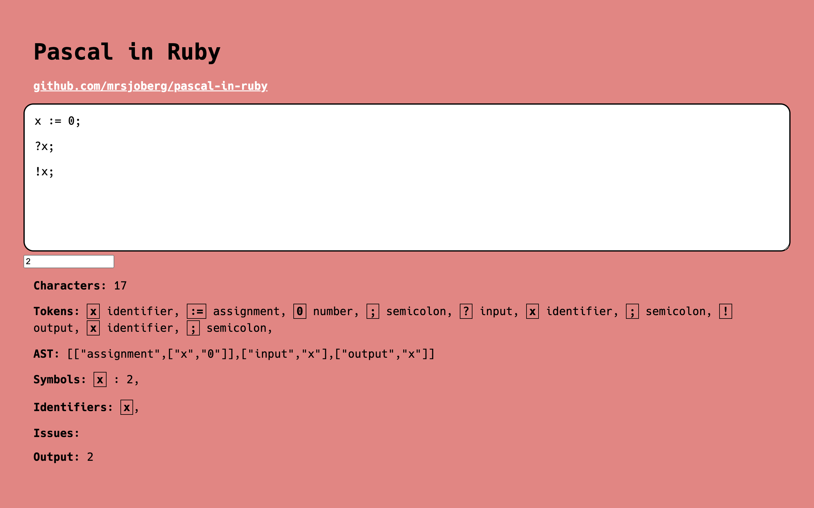

# Pascal in Ruby



Blog post: [michaelsjoberg.com/posts/writing-an-interactive-interpreter-in-ruby](https://michaelsjoberg.com/posts/writing-an-interactive-interpreter-in-ruby)

## Grammar (PL/0)

[wikipedia.org/wiki/PL/0](https://en.wikipedia.org/wiki/PL/0) with some minor modifications. 

```ebnf
(* program *)

program = { statement };

statement = assign_stmt | input_stmt | output_stmt | if_stmt | while_stmt ;

assign_stmt = identifier ':=' expr ';';

input_stmt = '?' identifier ';';

output_stmt = '!' expr ';';

(* control flow *)

if_stmt = 'if' condition ('then' | '{') statement ('end' | '}');

while_stmt = 'while' condition ('do' | '{') statement ('end' | '}');

(* condition *)

condition = cond_odd | cond_expr;

cond_odd = 'odd' expr;

cond_expr = expr ('=' | '<' | '>') expr;

(* expression *)

expr = term {('+' | '-') term};

term = factor {('*' | '/') factor};

factor = identifier | number | '(' expr ')';
```

## Examples

```pascal
x := 0;
while x<5 {
    x := x + 1;
}
!x;
```

This example simply increments and outputs `x`.

```pascal
x := 0;
y := 0;

?x;
?y;

!(x + y);
```

This example takes inputs from user (input boxes are automatically generated) and outputs the sum. User inputs currently persists until reloading page.
